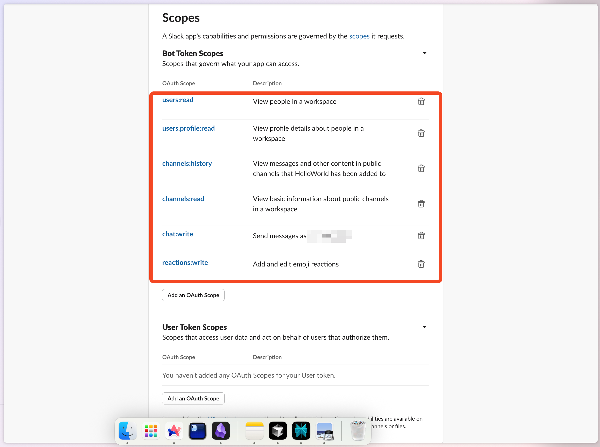

# Generate Slack Token with Slack App

The _v6.x version and above_ of the Slack Notification task will be using the OAuth Access Token to authenticate with the Slack API. Use the following directions to create the OAuth Access Token.

## 1. Create New Slack App

Goto [https://api.slack.com/apps](https://api.slack.com/apps) and click on the **Create New App** button to create a new slack application.

Select **From scratch** option.
In the next popup add a new **App Name** and select the **Slack Workspace** and click on the **Create App** button

## 2. Select the Token Scopes

Once the application is created in the **Sidebar** section click on the **OAuth & Permissions** button to set the token scopes

You can choose either **Bot Token** or **User Token** to generate the token.

**Bot Token** is used to authenticate with the Slack API on behalf of the bot.
**User Token** is used to authenticate with the Slack API on behalf of the user.

Under **Token Scopes** select the following scopes
* **chat:write** - Send messages on the user's behalf
* **reactions:write** - Add reactions to messages on the user's behalf
* **users:read** - View people in the workspace
* **users.profile:read** - View user's profile information
* **channels:history** - View channel history
* **channels:read** - View channel information

## 3. Install the Application in the Workspace

Next step is to install the application in the desired workspace and allow access to the requested scopes. Click on the  **Install App to Workspace** button

Then on the concent screen click on **Allow** button to give the necessary permissions.

## 4. Copy OAuth Access Token

Finally, copy the **OAuth Access Token** and use it in the **Slack API Token** field.

